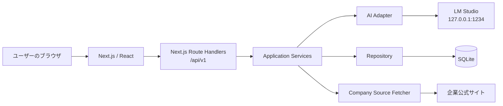
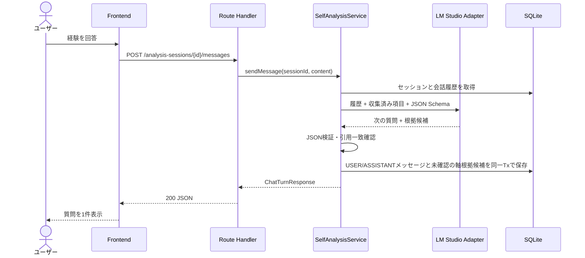
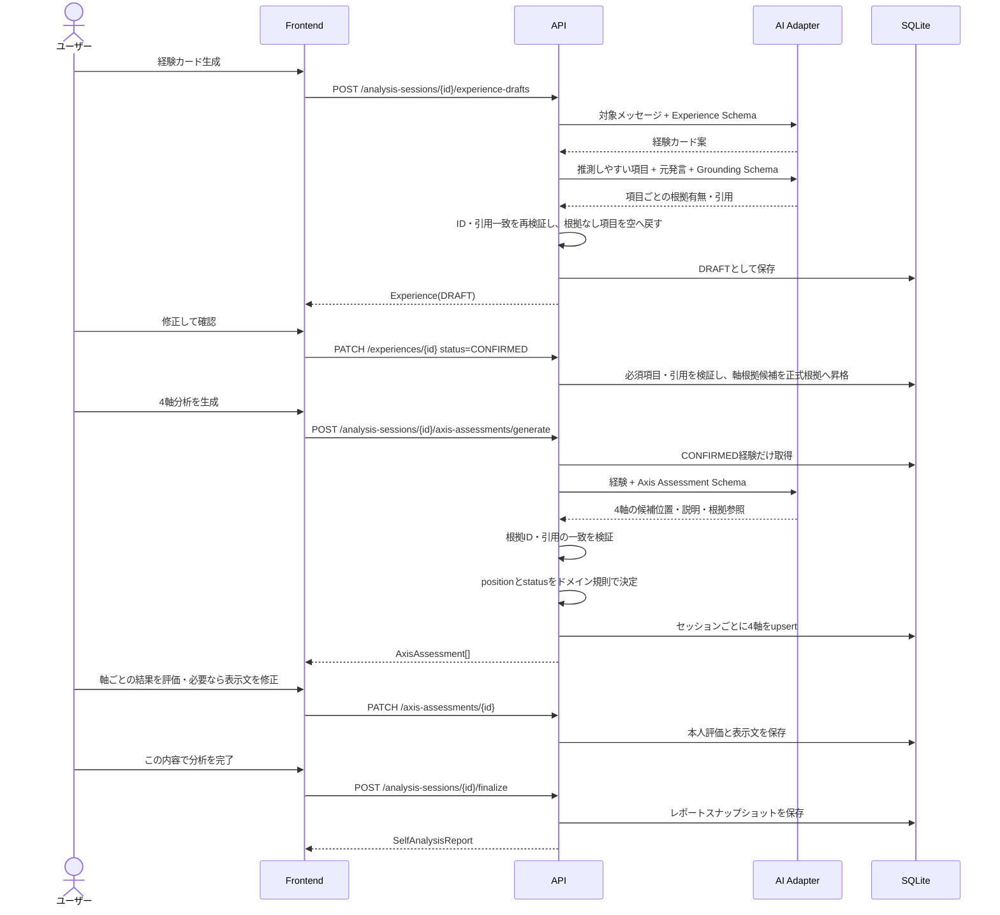
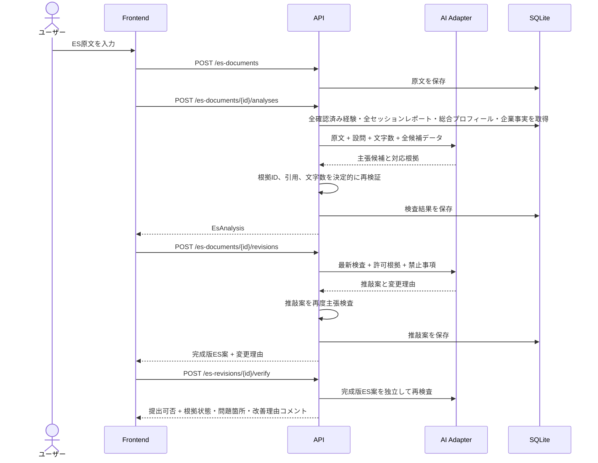
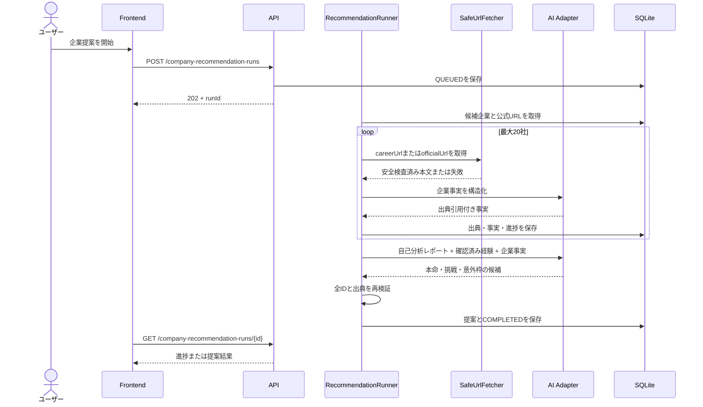

# Polaris アーキテクチャ

## 1. システム構成



ハッカソン版ではNext.js、SQLite、LM Studio、ブラウザを同じWindows PC上で動かす。LM Studioは`127.0.0.1`だけで待ち受け、ブラウザから直接呼び出さない。

## 2. 技術スタックの基準

| 層 | 採用 | 備考 |
|---|---|---|
| 言語 | TypeScript | フロント、API、AI連携を統一 |
| Web | Next.js App Router / React | Route HandlersはNode.js runtime |
| UI | Material UI | チャット、カード、比較画面 |
| フォーム | React Hook Form + Zod | OpenAPIと同じ制約を反映 |
| DB | SQLite | 単一ユーザー、ローカルMVP |
| ORM | Prisma ORM + `@prisma/adapter-better-sqlite3` | Prisma Schemaとmigrationを正本とする |
| AI | LM Studio | TypeScript SDKをAI Adapter内に隔離 |
| HTML解析 | Cheerio | P1のURL取り込み |
| PDF/DOCX | PDF.js / Mammoth | P2。P0に含めない |
| グラフ | Recharts | 4軸の位置と根拠状態の表示に利用可。数値能力グラフにはしない |

Pythonは使用しない。AIモデル名をコードへ直書きせず、環境変数で切り替える。
PrismaはNode.js runtimeで使用し、Edge runtimeへ配置しない。

## 3. コンポーネント境界

次の構成は責務分割の目標を示す。ディレクトリ名そのものをHTTP契約として扱わない。

```text
src/
  app/
    (screens)/                 画面とUI状態
    api/v1/                    HTTP変換だけを行うRoute Handlers
  application/
    self-analysis/             ユースケース、状態遷移
    companies/                 出典登録・企業事実抽出
    es/                        主張抽出、照合、推敲、再検査
  domain/
    experience/                経験カードと確認ルール
    axis-analysis/             独自4軸、pole別根拠、本人評価
    company/                   出典と企業事実
    es/                        主張、判定、変更
  infrastructure/
    ai/                        LM Studio Adapter、プロンプト、JSON検証
    db/                        Prisma Client、repository
    fetch/                     URL安全性検査、HTML/PDF/DOCX抽出
  shared/
    validation/                Zod、文字数などの決定的ロジック
    errors/                    エラーコードとHTTP変換
```

Route Handlerへプロンプト、SQL、業務判定を直接書かない。AIが行うのは抽出・言語化であり、状態判定、文字数、参照整合性はTypeScript側が決定する。

### 現在の実装配置

P0時点では、上記のApplication Service／Domain相当の決定的処理を`src/server`へまとめている。現在の主な対応は次のとおり。

| 責務 | 現在の配置 |
|---|---|
| HTTP変換 | `src/app/api/v1/**/route.ts` |
| 状態判定・文字数・レスポンス整形・ES処理 | `src/server` |
| LM Studio Adapter・プロンプト・Schema検証 | `src/infrastructure/ai` |
| Prisma Client生成物 | `src/generated/prisma` |
| Prisma Client初期化 | `src/lib/prisma.ts` |
| DB正本 | `prisma/schema.prisma` |
| AI構造化出力契約 | `contracts/ai` |

`src/application`、`src/domain`、`src/infrastructure/fetch`への再分割は、責務が増えて独立テストが必要になった時点で行う。配置変更だけを目的にP0の動作済みコードを一括移動しない。

## 4. 担当境界

| 担当 | 成果物 | 責任範囲 |
|---|---|---|
| AI | プロンプト、`contracts/ai`、評価ケース | 4軸の候補位置・説明、入力文脈、根拠引用、幻覚防止、モデル評価 |
| バックエンド | `/api/v1`、DB、Application Service | HTTP契約、永続化、AI出力検証、再開／再開始、状態遷移、エラー、統合 |
| フロントA | 自己分析体験 | チャット、進捗、経験カード確認・修正 |
| フロントB / UX | 活用体験 | セッション4軸、ホーム総合傾向・強み・弱み、企業情報、ES比較、デモ導線 |

AI担当は「JSONがだいたい返る」で完了にせず、JSON Schemaへ適合する代表入力・失敗入力をバックエンド担当へ渡す。バックエンド担当は不正なAI出力をDBへ保存しない。

## 5. ホームとセッション再開

ホームは`GET /api/v1/dashboard`で、進行中セッション、全履歴から生成した総合プロフィール、保存済みES要約を取得する。セッションごとの過去結果一覧は返さない。

- 進行中セッションがなければ`POST /analysis-sessions`で開始する。
- 「続きから」は`GET /analysis-sessions/current`とメッセージ一覧で復元する。
- 「初めから」は`startMode=RESTART_ACTIVE`で作成し、進行中セッションを`ABANDONED`にして新規セッションを同一トランザクションで作る。
- 完了済みレポートと確認済み経験は再開始時に削除しない。
- 新セッション固有の4軸分析にはそのセッションで確認した経験だけを使う。過去経験はホーム総合プロフィールとES生成には含める。
- 一つの完了セッションにつき`SelfAnalysisReport`は1件だけとし、`ABANDONED`セッションには作成しない。
- ホーム総合プロフィールは`POST /api/v1/overall-self-analysis/recompute`で全完了セッションから再計算する。AIを呼ぶため`GET /dashboard`内では再計算しない。
- P0では固定デモユーザーを使用し、Google認証はP1とする。

## 6. 自己分析チャットのシーケンス



AIが「終わりたい」等の終了意図を検出した場合、`completionIntent=SUGGESTED`を返す。Application Serviceはセッションを自動完了せず、UIの確認後に`finalize`が呼ばれた場合だけ完了処理を行う。

AI出力が不正な場合は最大1回だけ修復プロンプトで再試行し、それでも不正なら`AI_INVALID_OUTPUT`を返す。ユーザーメッセージを保存済み扱いにする場合は`clientMessageId`により再送を冪等にする。

## 7. 経験確定と4軸生成



4軸は`ENERGY_SOURCE`、`ACTION_STYLE`、`SATISFACTION_SOURCE`、`PREFERRED_ENVIRONMENT`。結果は左右の強制二択にせず、`BALANCED_OR_BOTH`、`CONTEXT_DEPENDENT`、`INSUFFICIENT_EVIDENCE`を許可する。USER回答が1件以上あれば生成でき、確認済み経験数による完了ブロックは設けない。

finalize成功時は4軸分析とキャリア条件をセッション固有の`SelfAnalysisReport`として1件保存する。保存後、UIは総合プロフィール再計算APIを呼ぶ。再計算が失敗してもセッションレポートをロールバックせず、以前の総合プロフィールを`STALE`として再試行を案内する。

総合プロフィールのAI入力には、全完了セッションのレポート、全確認済み経験、正式根拠、本人評価を渡す。AIは総合コメント、強み、弱み・注意点の候補を言語化し、最終的な4軸位置、参照ID、データ不足判定はApplication Serviceが再検証する。セッション位置を数値化して平均しない。

## 8. ES検査・推敲シーケンス



検査と推敲は、同じモデルを使う場合も別プロンプト・別処理にする。推敲後の再検査が終わるまで「安全」と表示しない。

企業情報は任意とする。企業未登録でも本人経験に関するES検査を実行できるが、企業に関する主張は企業出典なしで`VERIFIED`にしない。全履歴は候補としてAIへ渡すが、本文には設問と文字数に合う経験だけを選ぶ。問題箇所の文字範囲はサーバーが原文へ一意に対応づけられた場合だけ保存する。数値採点は行わない。

## 9. 企業情報取り込み

P0は文章貼り付けだけを保証する。P1のURL取得は次を満たす場合のみ有効にする。

- `http`または`https`
- DNS解決後・リダイレクト後を含め、loopback/private/link-local/metadata IPを拒否
- タイムアウト10秒、本文2MB、リダイレクト3回を上限
- HTML内のscriptを実行しない
- ページ内の「AIへの命令」をデータとして扱い、指示として実行しない
- 抽出した各事実へ出典URL、取得日時、原文引用を保存

## 10. 企業提案シーケンス

この機能はP1であり、自己分析とES推敲のE2E完成後だけ実装へ着手する。
候補企業はチーム登録の10〜20社に限定し、任意Web検索は行わない。



ローカルMVPではRedis等の外部キューを導入せず、SQLiteへ実行状態を保存する単一プロセスrunnerとする。
開発サーバー再起動後は`QUEUED`または処理中のrunを`FAILED`へ更新し、再実行を案内する。

## 11. 整合性と再計算

以下の変更時は関連結果を`STALE`にする。

| 変更 | 古くなる結果 |
|---|---|
| 確認済み経験の編集・削除 | 4軸分析、セッションレポート、ホーム総合プロフィール、その経験を使うES検査・推敲 |
| 4軸の本人評価・表示文変更 | セッションレポート、ホーム総合プロフィール、表現方針として利用したES推敲 |
| 企業情報の追加・削除 | 対象企業のES検査・推敲 |
| ES原文・設問・文字数変更 | そのESの検査・推敲 |

P0では自動再計算せず、画面へ「再検査が必要」と表示してユーザー操作で再実行する。
