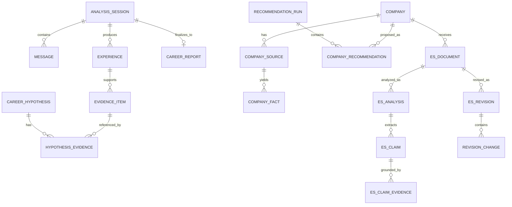
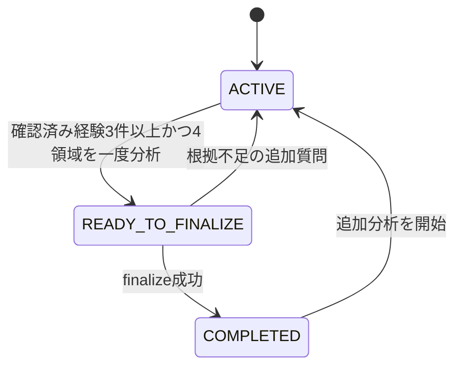
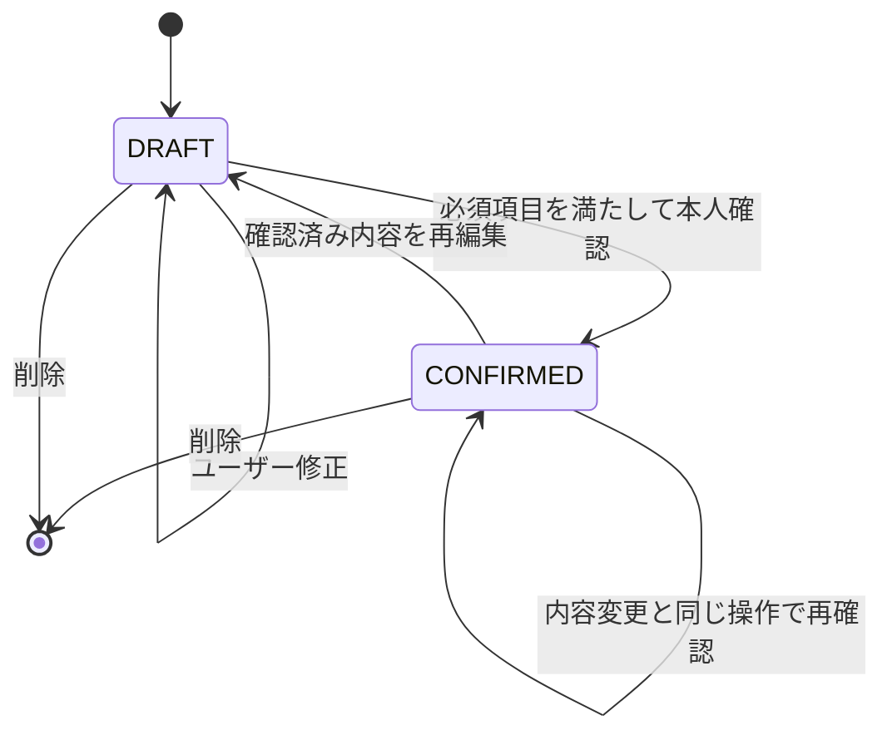
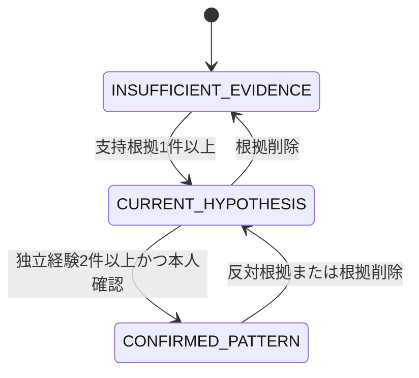
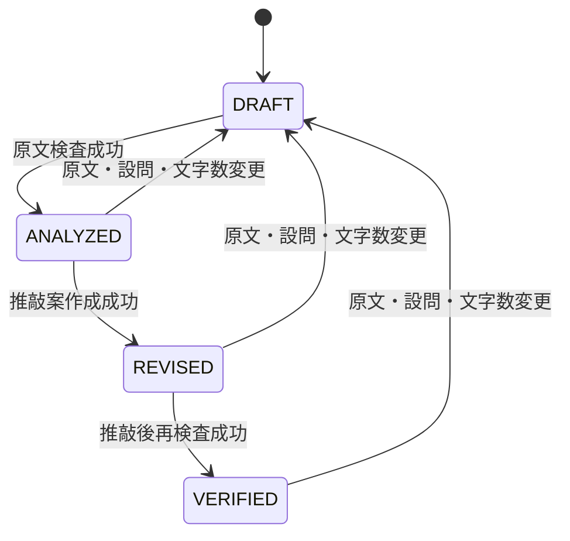

# Polaris ドメインモデル

## 1. 用語

| 用語 | 意味 | 事実として扱える条件 |
|---|---|---|
| 会話メッセージ | 自己分析セッション内のユーザーまたはAI発言 | 保存された原文そのもの |
| 経験カード | 一つの経験の状況、判断、行動、結果、感情、環境 | ユーザーが`CONFIRMED`にした場合のみ |
| 根拠 | 仮説や主張を支える／反証する、経験と引用の参照 | 参照IDが存在し、引用が元データに一致すること |
| キャリア仮説 | CAN／WANT／ENERGY／CONTEXTの現時点の解釈 | 診断結果ではない。ユーザー評価を別に保持する |
| 企業出典 | 企業ページ、貼り付け文、PDFなどの取得元 | `OFFICIAL`と未検証を区別する |
| 企業事実 | 出典から抽出した最小単位の記述 | 出典IDと原文引用が必須 |
| ES主張 | ES文中の本人・企業・将来に関する検査単位 | 根拠との照合結果を4段階で保持する |
| 推敲変更 | 原文の一部をどう変えたかとその理由 | 前後文、理由、根拠、採否を保持する |

## 2. 4領域の定義

### CAN

経験で実際に確認できた、再現可能性のある「行動」。形容詞ラベルではなく動詞を含む文で表現する。

- 良い: `問題を工程単位に分解する`
- 悪い: `論理的思考力が高い`

`CONFIRMED_PATTERN`にするには、原則として独立した確認済み経験2件以上の支持根拠と、ユーザーの`MATCHES`または`PARTIALLY_MATCHES`が必要。反対根拠がある場合は自動確定しない。

### WANT

本人が判断や選択で大切にしている価値観。「好き」という発言だけで確定せず、選択・理由・感情の根拠を必要とする。価値観が衝突する場合は、どちらを優先するか追加確認する。

### ENERGY

活動後の意欲・充実感の変化。経験カードでは`-2..2`で保持するが、UIでは次の意味ラベルを使う。

| 値 | 表示 |
|---:|---|
| 2 | 大きく元気になる |
| 1 | やや元気になる |
| 0 | 中立またはまだ不明 |
| -1 | やや消耗する |
| -2 | 大きく消耗する |

できる行動でも消耗する場合があるため、CANとENERGYを同一視しない。

### CONTEXT

CANやENERGYの発現に影響する環境条件。人数、裁量、変化速度、フィードバック距離、役割の明確さ、対話形式など、具体条件で表現する。

## 3. データ関係



## 4. 状態遷移

### 自己分析セッション



### 経験カード



確認済み経験を編集し、同じ更新操作で`CONFIRMED`を明示しない場合は`DRAFT`へ戻す。
編集フォームの「保存して確認」操作だけは、必須項目検証後に同一トランザクションで再確認してよい。
これにより、編集中の値をESの事実根拠として使わない。

### キャリア仮説



`status`は根拠の充実度、`userAssessment`は本人の評価であり、別軸として保存する。

### ES文書



## 5. 仮説ステータスの決定ルール

TypeScript側で次の順序により決定する。AIにステータスを最終決定させない。

```text
supportingConfirmedExperienceCount = 支持根拠に含まれる異なる確認済み経験数
counterConfirmedExperienceCount = 反対根拠に含まれる異なる確認済み経験数

if supportingConfirmedExperienceCount == 0:
    INSUFFICIENT_EVIDENCE
else if supportingConfirmedExperienceCount >= 2
        and counterConfirmedExperienceCount == 0
        and userAssessment in [MATCHES, PARTIALLY_MATCHES]:
    CONFIRMED_PATTERN
else:
    CURRENT_HYPOTHESIS
```

数値confidenceはログ・評価用途で内部保持してもよいが、判定条件にも画面表示にも使わない。

## 6. ES主張判定

| 判定 | 条件 |
|---|---|
| `VERIFIED` | 主張と同じ意味の確認済み経験または企業事実があり、数字・期間・役割も一致 |
| `PARTIALLY_VERIFIED` | 近い根拠はあるが、主張の一部を断定できない |
| `NEEDS_CONFIRMATION` | 対応する根拠がない、または未確認経験しかない |
| `CONTRADICTED` | 登録済み根拠と明示的に矛盾する |

例:

| ES文 | 登録情報 | 判定 |
|---|---|---|
| 10人のチームで活動した | チーム人数10人 | `VERIFIED` |
| リーダーとして全員を指揮した | 役割は進行担当 | `NEEDS_CONFIRMATION`または`CONTRADICTED` |
| 御社は若手に大きな裁量がある | 「若手の提案を歓迎」とだけ記載 | `PARTIALLY_VERIFIED` |
| 売上を2倍にした | 売上20%増と確認済み | `CONTRADICTED` |

CANやWANTは表現方針には使えるが、役割・数字・成果などの事実証明には使えない。

## 7. ES推敲の禁止ルール

- 数字、期間、役割、成果を新しく作らない。
- 未確認経験を事実として使わない。
- 企業が公開していない特徴を断定しない。
- ユーザーが示していない志望理由・価値観・将来像を追加しない。
- キャリア仮説を客観的な能力証明として書かない。
- 根拠不足を自然な文章で隠さない。不足時は質問または削除案を出す。
- 推敲後は必ず新しい主張を再抽出し、原文と同じ照合を行う。

## 8. 企業提案ルール

- 候補企業は登録済み企業だけとし、MVPでは`recommendationEligible=true`の10〜20社をチームが用意する。
- 企業名・URLの発見をローカルLLMの記憶へ任せない。
- 提案前に`careerUrl`、なければ`officialUrl`を取得し、公式出典から企業事実を更新する。
- URL取得失敗時はキャッシュ済み公式情報を使ったことを警告し、キャッシュもなければ候補から除外する。
- 提案は`PRIMARY`（本命）、`CHALLENGE`（挑戦）、`UNEXPECTED`（意外）の枠で表示する。
- 適性率、内定確率、能力点数を表示しない。
- 各提案には確認済み経験、公式出典、合いそうな条件、懸念、不明点、確認質問が必要。
- `rank`は表示順であり、適性スコアではない。

## 9. 最小データベース表

実DDLは[database-schema.sql](./database-schema.sql)を参照。役割は次の通り。

| 表 | 役割 |
|---|---|
| `analysis_sessions` | 自己分析の進捗と状態 |
| `messages` | 会話原文。根拠引用の最上流 |
| `experiences` | 経験カード本体 |
| `experience_quotes` | 経験と会話原文の対応 |
| `evidence_items` | 4領域の根拠候補 |
| `career_hypotheses` | AI初回文、表示文、本人評価、状態 |
| `hypothesis_evidence` | 仮説と根拠の多対多 |
| `career_reports` | 最終レポートのスナップショット |
| `companies` | 応募企業 |
| `company_sources` | 出典メタデータと原文 |
| `company_facts` | 出典から抽出した事実 |
| `es_documents` | 設問とユーザー原文 |
| `es_analyses` | 原文または推敲後の検査結果 |
| `es_claims` | 文中主張と判定 |
| `es_claim_evidence` | 主張と経験／企業事実の対応 |
| `es_revisions` | 推敲案 |
| `revision_changes` | 変更単位の理由、根拠、採否 |
| `recommendation_runs` | 公式URL取得・企業比較の非同期実行状態 |
| `company_recommendations` | 本命／挑戦／意外枠と根拠・懸念・確認質問 |

Prisma実装の正本は[`prisma/schema.prisma`](../prisma/schema.prisma)。
`database-schema.sql`はテーブル構造と制約をレビューしやすくする参照DDLであり、実migrationはPrisma Migrateで生成する。
