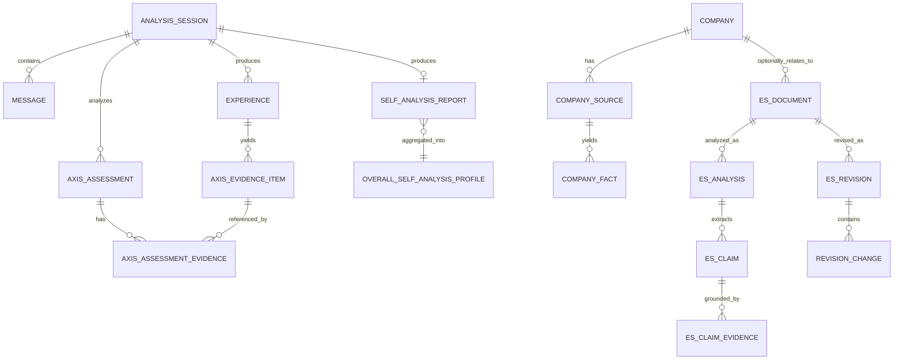
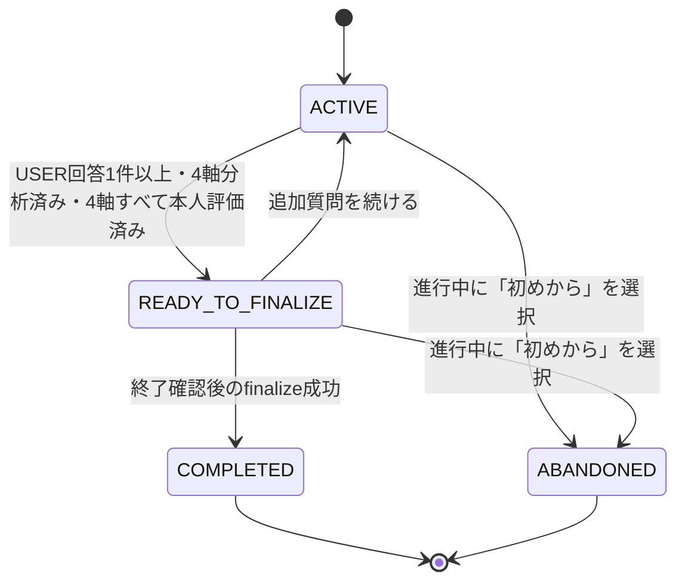
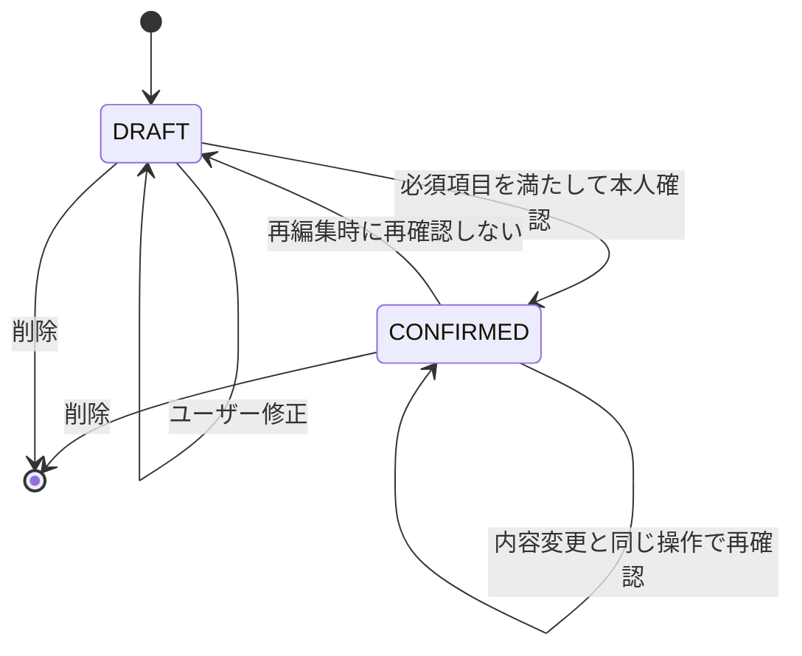
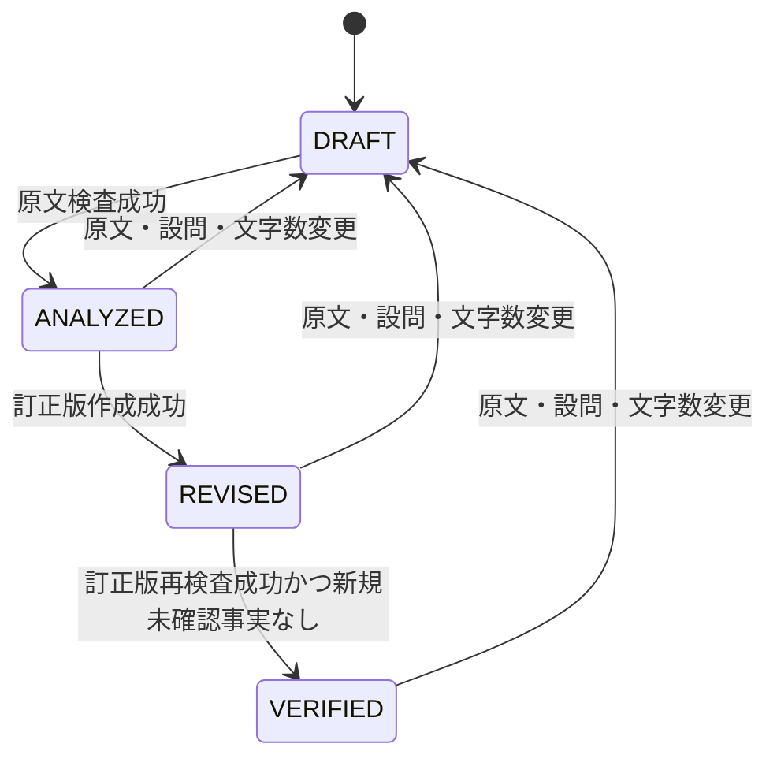

# Polaris ドメインモデル

## 1. 用語

| 用語 | 意味 | 事実として扱える条件 |
|---|---|---|
| 会話メッセージ | 自己分析セッション内のユーザーまたはAI発言 | 保存された原文そのもの |
| 軸根拠候補 | チャットAIが会話中に抽出した4軸の候補 | そのまま正式根拠にはしない。参照先確認と経験の本人確認が必要 |
| 経験カード | 一つの経験の状況、判断、行動、結果、感情、環境 | ユーザーが`CONFIRMED`にした場合のみ |
| 軸根拠 | 4軸の片側・両方・状況差を支える経験と引用 | 参照IDが存在し、引用が元のUSER発言に一致すること |
| 軸分析 | 4軸それぞれの現在位置、説明、根拠、状況差 | 診断結果ではない。本人評価を別に保持する |
| セッション自己分析レポート | 完了した一つのAIチャットの4軸分析とキャリア条件 | 完了セッションごとに必ず1件。生成時点の根拠を保持する |
| ホーム総合プロフィール | 全完了セッションと全確認済み経験から再集計した4軸傾向・強み・弱み | セッション位置の数値平均ではなく、全根拠から再計算する |
| データ量表示 | 完了セッション数、USER発言数、確認済み経験数と不足警告 | 結果生成を禁止する条件ではなく、解釈上の注意として表示する |
| 企業出典 | 企業ページや貼り付け文などの取得元 | `OFFICIAL`と未検証を区別する |
| 企業事実 | 出典から抽出した最小単位の記述 | 出典IDと原文引用が必須 |
| ES主張 | ES文中の本人・企業・将来に関する検査単位 | 根拠との照合結果を4段階で保持する |
| ES指摘範囲 | ES原文でコメントの対象となる文字範囲 | サーバーが原文との一致を検証できた場合のみ |
| 推敲変更 | 原文の一部をどう変えたかとその理由 | 前後文、理由、根拠、採否を保持する |

## 2. 独自4軸

### ENERGY_SOURCE — Focus ↔ Connect

エネルギーを得やすい関わり方を見る。Focusは一人または少人数で対象へ集中する状態、Connectは他者との対話・共創・反応から活力を得る状態を指す。

一人で成果を出した事実だけではFocusの根拠にならず、その状態での感情・充実感・本人の選択理由を必要とする。同様に、チーム経験だけでConnectと判定しない。

### ACTION_STYLE — Plan ↔ Experiment

行動を始め、前へ進める時の好みを見る。Planは見通し・順序・役割を先に設計する傾向、Experimentは小さく試し、反応を見ながら更新する傾向を指す。

計画能力や実行能力の優劣ではない。同じ人が高リスク場面ではPlan、探索場面ではExperimentを選ぶ場合は`CONTEXT_DEPENDENT`とする。

### SATISFACTION_SOURCE — Mastery ↔ Impact

活動後の満足を得やすい対象を見る。Masteryは知識・技術・理解の深まり、Impactは他者・利用者・組織・社会への変化や貢献を指す。

成果が大きいことだけでImpactと判断せず、本人が何に満足したかの明示を必要とする。習熟と貢献の両方を満たす場合は`BALANCED_OR_BOTH`を許可する。

### PREFERRED_ENVIRONMENT — Stable ↔ Dynamic

継続的に動きやすい環境を見る。Stableは役割・見通し・基準が比較的予測可能な環境、Dynamicは変化・曖昧さ・試行錯誤が多い環境を指す。

環境への適応可否ではなく、好みとエネルギー負荷を扱う。変化へ対応できることと、変化を好むことを混同しない。

## 3. 軸位置

| 値 | 意味 |
|---|---|
| `LEFT` | 現在の確認済み根拠が左側へ明確に寄っている |
| `LEANS_LEFT` | 左側の根拠が比較的多いが、確定できない |
| `BALANCED_OR_BOTH` | 両側を同程度に使う、または両側から価値を得る |
| `LEANS_RIGHT` | 右側の根拠が比較的多いが、確定できない |
| `RIGHT` | 現在の確認済み根拠が右側へ明確に寄っている |
| `CONTEXT_DEPENDENT` | 状況・役割・目的により使い分ける根拠がある |
| `INSUFFICIENT_EVIDENCE` | 判断できるだけの確認済み根拠がない |

位置は連続的な能力点数ではなく、根拠状態を説明する表示区分である。片側の根拠不足から反対側を推定してはならない。

軸根拠には`LEFT`、`RIGHT`、`BOTH`、`CONTEXT_DEPENDENT`、`UNKNOWN`のpoleを付ける。さらに`SUPPORT`、`COUNTER`、`UNKNOWN`で、その解釈を支持・反証・未確定に分ける。

## 4. データ関係



## 5. 状態遷移

### 自己分析セッション



同一ユーザーについて、`ACTIVE`または`READY_TO_FINALIZE`は最大1件とする。P0の単一ユーザーでもこの制約を守る。

「続きから」は進行中セッションとメッセージを取得する。「初めから」は進行中セッションを`ABANDONED`にし、新しいセッションを同一トランザクションで作る。完了済みレポートと確認済み経験は削除しないが、過去経験を新セッション固有の4軸分析へは含めない。過去分はホーム総合プロフィールとES生成では引き続き使用する。

セッション結果の生成に確認済み経験数の下限を設けない。USERメッセージが1件以上あれば4軸分析と本人評価へ進める。確認済み根拠がない軸は`INSUFFICIENT_EVIDENCE`にするが、セッションレポート自体は作成できる。`ABANDONED`セッションにはレポートを作らない。

### 経験カード



確認済み経験を編集し、同じ更新操作で`CONFIRMED`を明示しない場合は`DRAFT`へ戻す。編集中の値を自己分析・ESの正式根拠として使わない。

チャット応答の軸根拠候補はASSISTANTメッセージの`evidenceCandidates`として保存してよいが、正式な`axis_evidence_items`にはしない。経験カードが`CONFIRMED`になった時点で、経験に紐づくメッセージID、USER原文、引用一致、axis／poleを再検証し、成功した候補だけを正式根拠へ昇格する。

### 軸分析

軸分析の`status`と`position`は分ける。

- `position`: 4軸上の現在位置または状況依存・根拠不足
- `status`: 根拠の充実度
- `userAssessment`: 本人の評価

`status`は次の3値とする。

- `CONFIRMED_PATTERN`（画面表示は「本人確認済みの傾向」）
- `CURRENT_HYPOTHESIS`
- `INSUFFICIENT_EVIDENCE`

### ES文書



## 6. 軸ステータスと位置の決定ルール

AIは候補位置・説明・根拠参照を返す。最終`status`はTypeScript側で決定する。

```text
confirmedExperienceCount = 軸根拠に含まれる異なる確認済み経験数
hasBothPoleEvidence = LEFTとRIGHTの確認済み根拠がそれぞれ存在する
hasContextSwitchEvidence = 状況による使い分けの明示根拠が存在する

if confirmedExperienceCount == 0:
    position = INSUFFICIENT_EVIDENCE
    status = INSUFFICIENT_EVIDENCE
else if hasContextSwitchEvidence:
    position = CONTEXT_DEPENDENT
    status = CURRENT_HYPOTHESIS
else if hasBothPoleEvidence and 一方へ寄せる根拠が不足:
    position = BALANCED_OR_BOTH
else:
    AI候補を根拠集合と照合してLEFT〜RIGHTを採用

if confirmedExperienceCount >= 1
   and 矛盾・未解決の反証がない
   and userAssessment in [MATCHES, PARTIALLY_MATCHES]:
    status = CONFIRMED_PATTERN
else:
    status = CURRENT_HYPOTHESIS
```

内部confidenceを保持してもよいが、位置の決定条件や画面表示へ直接使用しない。

`CONFIRMED_PATTERN`は経験数の多さを表す値ではなく、確認済み根拠があり本人が傾向を確認したことを表す。データ量は別の集計値で表示し、経験が1件しかないことを隠さない。

## 7. セッションレポートとホーム総合プロフィール

finalize成功時に、そのセッションについて次を不変スナップショットとして1件だけ保存する。

- 4軸の位置・表示文・本人評価
- 各軸で使用した根拠ID
- 全体要約
- Must／Prefer／Avoid／Verify
- 次に試す行動
- USER発言数と確認済み経験数
- 生成日時

4軸のうち一つでも`userAssessment=UNREVIEWED`の場合はfinalizeせず、評価が必要な軸を返す。`DOES_NOT_MATCH`または`NEEDS_EXPLORATION`は本人の否定・保留としてそのまま保存し、肯定的な人物像へ変換しない。

後から経験や軸評価が変更された場合、セッションレポートを上書きせず`STALE`にする。ホームにはセッションレポート一覧を表示しないが、監査・総合再計算・ES生成の入力として保持する。

ホーム総合プロフィールは、全`COMPLETED`セッションのレポート、全`CONFIRMED`経験、正式な軸根拠、本人評価を入力として再計算し、次を現在値として保存する。

P0は単一ユーザーのため、総合プロフィールは`id=default`の1行をupsertし、過去の総合プロフィール履歴は持たない。元となるセッションレポートは保持する。

- 4軸それぞれの総合位置、コメント、根拠ID、参照セッションID
- 全体要約
- 根拠付きの強み
- 根拠付きの弱み・注意点
- 完了セッション数、USER発言数、確認済み経験数
- データ不足フラグと警告理由
- 使用したセッションレポートID、生成日時、鮮度

総合位置は、各セッションの`LEFT`等を数値へ変換して平均しない。全セッションの正式根拠を軸・pole・状況別に統合し、セッション固有結果と同じ決定規則で再判定する。一つのセッションに大量の発言があっても、それだけで他セッションより強い票として扱わない。

強み・弱みには必ず参照セッションと正式根拠を持たせる。弱みは人格や能力の欠陥として断定せず、苦手になりやすい状況、負荷条件、今後の確認事項として表現する。根拠がない場合は空配列を許可し、数合わせで生成しない。

初期のデータ不足表示は、`completedSessionCount < 2`または`confirmedExperienceCount < 3`のとき有効にする。この値は結果生成を止める閾値ではなく、画面の注意表示だけに使う。USER発言数も併記する。

## 8. ES主張判定

| 判定 | 条件 |
|---|---|
| `VERIFIED` | 主張と同じ意味の確認済み経験または企業事実があり、数字・期間・役割も一致 |
| `PARTIALLY_VERIFIED` | 近い根拠はあるが、主張の一部を断定できない |
| `NEEDS_CONFIRMATION` | 対応する根拠がない、または未確認経験しかない |
| `CONTRADICTED` | 登録済み根拠と明示的に矛盾する |

4軸分析は文章の方向性を考える補助には使えるが、役割・数字・成果などの事実証明には使えない。

ES検査・推敲では、全セッションレポートとホーム総合プロフィールを表現方針の候補として渡し、全確認済み経験を本人事実の候補として渡す。AIは設問と文字数に関連する根拠を選び、すべての経験を本文へ列挙する必要はない。セッションレポートや総合プロフィールだけで数字・役割・成果を証明してはならない。

ES指摘範囲はUnicodeコードポイント基準の`startOffset`（含む）と`endOffset`（含まない）で表す。AIが返した対象文をサーバーが原文へ一意に対応づけられた場合だけ保存し、曖昧な場合は範囲を省略して対象文を表示する。

## 9. ES推敲の禁止ルール

- 数字、期間、役割、成果を新しく作らない。
- 未確認経験を事実として使わない。
- 企業が公開していない特徴を断定しない。
- ユーザーが示していない志望理由・価値観・将来像を追加しない。
- 4軸分析を客観的な能力証明として書かない。
- 根拠不足を自然な文章で隠さない。不足時は質問または削除案を出す。
- 推敲後は必ず新しい主張を再抽出し、原文と同じ照合を行う。
- 数値点数を生成せず、根拠状態・問題箇所・改善理由で説明する。
- 完成版ES案の直下に、再検査後の根拠状態、残る問題箇所、改善理由をAIコメントとして表示する。
- 設問回答、文字数、全主張の根拠を満たす場合だけ`READY_TO_SUBMIT`とし、満たさない場合は`NEEDS_REVIEW`とする。

## 10. 企業提案ルール（P1）

- 候補企業は登録済み企業だけとする。
- 企業名・URLの発見をローカルLLMの記憶へ任せない。
- 公式出典から企業事実を更新してから提案する。
- 適性率、内定確率、能力点数を表示しない。
- 各提案には確認済み経験、公式出典、合いそうな条件、懸念、不明点、確認質問が必要。

## 11. 最小データベース表

実DDLは[database-schema.sql](./database-schema.sql)を参照する。

| 表 | 役割 |
|---|---|
| `analysis_sessions` | 自己分析の進捗、再開、再開始、完了状態 |
| `messages` | 会話原文と未確認の軸根拠候補。根拠引用の最上流 |
| `experiences` | 経験カード本体 |
| `experience_quotes` | 経験と会話原文の対応 |
| `axis_evidence_items` | 4軸のpole別根拠候補 |
| `axis_assessments` | セッションごとの4軸分析、本人評価、状態 |
| `axis_assessment_evidence` | 軸分析と根拠の多対多 |
| `self_analysis_reports` | finalize時点の結果スナップショット |
| `overall_self_analysis_profiles` | 全セッションから再計算するホーム用総合傾向、強み、弱み、データ量 |
| `companies` | 任意の応募企業 |
| `company_sources` | 出典メタデータと原文 |
| `company_facts` | 出典から抽出した事実 |
| `recommendation_runs` | P1の企業提案ジョブ、進捗、警告 |
| `company_recommendations` | P1の企業別提案、根拠、懸念、不明点 |
| `es_documents` | 設問、文字数、ユーザー原文 |
| `es_analyses` | 原文または訂正版の検査結果 |
| `es_claims` | 文中主張、判定、任意の指摘範囲 |
| `es_claim_evidence` | 主張と経験／企業事実の対応 |
| `es_revisions` | 訂正版 |
| `revision_changes` | 変更単位の理由、根拠、採否 |

Prisma実装の正本は[`prisma/schema.prisma`](../prisma/schema.prisma)。`database-schema.sql`はレビュー用参照DDLであり、実migrationはPrisma Migrateで生成する。
