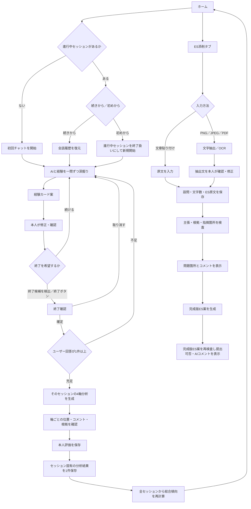

# Polaris MVP スコープ定義

## 1. プロダクト概要

Polarisは、ローカルLLMとの会話からユーザーの経験を整理し、根拠をたどれる4軸の自己分析結果と、事実を創作しないES検査・推敲を提供する就活支援Webアプリである。

主要価値は次の2つに限定する。

1. AIとの会話による、根拠付き自己分析
2. 本人が確認した経験と任意の企業情報に基づく、根拠付きES検査・推敲

自己分析ではMBTIや性格タイプへ分類しない。以下の4軸を、現時点の経験から考えられる仮説として整理する。

| 軸 | 左側 | 右側 | 見るもの |
|---|---|---|---|
| エネルギー源 | Focus（集中） | Connect（共創） | 一人で集中する時と、人と関わる時のどちらでエネルギーを得やすいか |
| 行動スタイル | Plan（設計） | Experiment（実験） | 先に計画を組む時と、小さく試す時のどちらで動きやすいか |
| 満足の源 | Mastery（習熟） | Impact（貢献） | 自分の習熟と、他者・社会への影響のどちらに満足を感じやすいか |
| 好む環境 | Stable（安定） | Dynamic（変化） | 予測可能な環境と、変化の多い環境のどちらを好みやすいか |

4軸は二者択一の性格診断ではない。各軸で`左寄り`、`やや左寄り`、`両方・中間`、`やや右寄り`、`右寄り`、`状況依存`、`根拠不足`を区別する。片側の根拠がないことを、反対側の根拠として扱わない。

## 2. 想定ユーザーと実行モード

- 就活を始めたが、自分の経験をうまく言語化できない学生
- 自分の傾向を診断名ではなく、具体的な経験と一緒に理解したい学生
- 企業ごとにESを書き直す負担を感じている学生
- 汎用生成AIが数字・役割・企業情報を盛ることに不安がある学生

P0はデモPCを使う単一ユーザー・認証なしで動かす。画面上はホームから開始する。Googleログイン／新規登録はP1として実装し、P0のAPI・DBを認証へ依存させない。

## 3. 必須ユーザーフロー

## 4. ホーム要件

ホームは次を表示する。

- 進行中セッションがある場合の「続きから」導線
- 「初めから」新しいセッションを始める導線
- 自己分析未実施時の案内文
- 全完了セッション・全確認済み経験から再計算した総合4軸傾向
- 総合傾向の軸ごとの表示位置、コメント、根拠数、根拠不足表示
- 総合傾向から根拠付きで整理した「強み」と「弱み・注意点」
- 完了セッション数、会話数、確認済み経験数と、データが少ない場合の注意表示
- 保存済みESと最新の検査状態
- AIチャット、自己分析、ES添削へ移動するタブ

セッション固有の結果は内部データとして上書きせず保存するが、ホームへ過去セッション一覧は表示しない。ホーム用総合傾向が古くなった場合は`STALE`と表示し、全履歴からの再集計を案内する。

## 5. 自己分析ルール

- AIは一度に一つだけ質問する。
- 会話から作る経験カードは必ず`DRAFT`で保存する。
- ユーザーが確認した`CONFIRMED`経験だけを4軸分析とESの本人事実根拠に使う。
- 一つの完了したAIチャットセッションにつき、自己分析結果を必ず1件だけ保存する。
- ユーザー回答が1件以上あれば結果生成を許可し、確認済み経験数を完了条件にしない。
- 各軸の支持根拠、反対側の根拠、状況差、矛盾、不明点を保持する。
- 片側の証拠がないことを、反対側の証拠として扱わない。
- `両方・中間`、`状況依存`、`根拠不足`を正式な結果として許可する。
- AIの数値confidenceをユーザーへ表示しない。
- 軸の左右に優劣を付けない。
- 軸の位置から職種・企業への適性を断定しない。
- 各結果から根拠の経験とユーザー原文へ遡れるようにする。
- ユーザーは各軸結果に「当てはまる／一部当てはまる／当てはまらない／追加で考えたい」を保存できる。
- レポート確定前に4軸すべてへの本人評価を必須とし、未評価の軸をAIの確定所見として保存しない。

確認済み経験が0件の軸は`INSUFFICIENT_EVIDENCE`にできる。結果生成自体は止めず、データ量の少なさを結果とホームへ明示する。ホームの総合傾向はセッション結果の位置を数値平均せず、全セッションの確認済み経験・引用・本人評価を軸ごとに再集計して作る。

ホームの強み・弱みには必ず参照セッションと正式根拠を付ける。弱みは人格評価として断定せず、「苦手になりやすい状況」「負荷がかかりやすい条件」「今後確認したい点」として記述する。根拠がない項目を数合わせで生成しない。

「終わりたい」等の発言は、AIが終了候補として検出してよい。ただし自動でセッションを完了させず、画面で明示確認した後だけ分析生成を開始する。

## 6. ES要件

- ES原文は文章貼り付け、PNG/JPEG画像、PDFのいずれかから入力できる。
- 画像とPDFは最大10MB、PDFは最大10ページとする。パスワード付きPDFは受け付けない。
- PNG/JPEGと画像のみのPDFはローカルOCR、文字レイヤーを持つPDFはテキスト抽出を優先する。
- ファイルから抽出した文章は必ず編集可能な入力欄へ表示し、ユーザーが確認してからES原文として保存する。
- アップロード元の画像・PDFは永続化せず、確認済みの文章だけを`originalText`として保存する。
- ES原文、設問、文字数制限を下書きとして保存できる。
- 全完了セッションの自己分析結果と全確認済み経験をAIへ候補情報として渡し、設問と文字数制限に最も合う根拠をAIが選ぶ。
- すべての経験を本文へ無理に詰め込まず、候補集合を網羅した上で関連する経験だけを使用する。
- 企業情報は任意とし、未登録でも本人経験に関する検査は実行できる。
- 企業事実を検査する場合は、出典付き企業情報だけを根拠に使う。
- ESを主張単位へ分解し、`確認済み`、`一部確認`、`要確認`、`矛盾`を表示する。
- 問題箇所は、可能な場合に原文内の範囲と対応づけて表示する。
- 数値点数による「採点」は行わない。
- AIは、そのまま提出できる品質を目標にした完成版ES案を生成する。
- AIが返す検査・添削結果と完成版ES案は文章のみとし、画像・PDFファイルは生成しない。
- 完成版ES案の下に、根拠状態、問題箇所、改善理由をAIコメントとして表示する。
- 原文を上書きせず、訂正版を別バージョンとして保存する。
- 訂正版も同じルールで再検査する。
- 推敲後に新しい未確認事実がある場合は、安全完了扱いにしない。
- 再検査で設問回答、文字数、全主張の根拠を満たした場合だけ`READY_TO_SUBMIT`とし、それ以外は`NEEDS_REVIEW`とする。

## 7. MVP完成条件

- LM Studioの起動・モデルロード状態を画面から確認できる。
- ホームから初回開始、続きから、初めからを選択できる。
- 「初めから」で過去の完了済み結果や確認済み経験を削除しない。
- 「初めから」の新セッションでは、過去の確認済み経験をそのセッション固有の4軸分析へ自動で混ぜない。過去経験は経験一覧、ホーム総合傾向、ESの候補集合には残す。
- 自己分析チャットではAIが一度に一つだけ質問する。
- ユーザー回答1件以上で、確認済み経験が少なくてもセッション結果を作成できる。
- ユーザーが経験カードを修正し、確認済みにできる。
- 独自4軸の位置・コメント・根拠・根拠不足を生成できる。
- 各軸から根拠の経験とユーザー発言へ遡れる。
- 各軸結果への本人評価を保存できる。
- 4軸すべての本人評価が終わるまでレポートを確定できない。
- 全セッションの根拠から総合4軸傾向、強み、弱み・注意点を表示できる。
- セッション数または経験数が少ない場合に「データが少ない」と表示できる。
- 文章貼り付け、PNG/JPEG画像、PDFからES原文を入力し、抽出文を本人確認後に保存できる。
- 本人の経験と任意の企業情報について、根拠状態と指摘箇所を表示できる。
- 提出可能品質を目標にした完成版ES案と、その下の根拠状態・問題箇所・改善理由を表示できる。
- 訂正版を再検査できる。
- LM Studio未起動、AI出力不正、タイムアウトをユーザーが復旧できる形で表示できる。

## 8. 優先度

### P0 — 必ず完成させる

- デモユーザーでのホーム
- LM Studio接続確認
- 初回／続きから／初めからのセッション管理
- 自己分析チャット
- 経験カード生成・確認・修正
- セッションごとの4軸分析・本人評価・結果保存
- 全セッションからの総合4軸傾向・強み・弱み・データ不足表示
- 自己分析の代表fixture・評価ケース
- 文章貼り付け、PNG/JPEG画像、PDFからのES原文入力・確認・保存
- ES検査・指摘箇所・推敲・再検査
- 企業情報の任意文章貼り付け

### P1 — P0完成後

- Googleログイン／新規登録／ログアウト
- ユーザーごとのデータ分離
- 企業公式ページのURL取得
- 登録済み候補企業からの根拠付き企業提案
- ES変更単位の採用・却下
- 面接の深掘り質問・逆質問
- 星図表現などの追加ビジュアル

### P2 — ハッカソン後

- 企業公式資料のPDF・DOCX・TXT取り込み
- 任意企業のWeb検索
- 複数ES間の矛盾検査
- 音声入力・面接練習
- RAG・ベクトル検索
- PostgreSQL・複数端末同期

## 9. MVP対象外

- MBTIなどの性格タイプ診断
- 4軸の強制的な二者択一
- 「自己分析82点」「企業との相性91%」のような擬似的な精密スコア
- ESの根拠不明な数値採点
- 職種・企業への適性の断定
- 独自AIモデルの学習
- 求人サイトの横断収集・スクレイピング
- 応募の自動化、メール連携
- ユーザー未作成のESを根拠なしでゼロから生成する機能
- AIの推測だけで本人・企業の事実を追加すること

## 10. 成功指標

- 初回開始、再開、再開始の3経路がデータ消失なく動く。
- 1件以上のユーザー回答からセッション結果を作成し、各軸の根拠へ2操作以内で遡れる。
- `両方・中間`、`状況依存`、`根拠不足`を誤って片側へ寄せず表示できる。
- セッション固有結果を保持したまま新しい分析を実行し、ホーム総合傾向とES候補へ反映できる。
- 未確認の数字・役割を含むテストESを`NEEDS_CONFIRMATION`または`CONTRADICTED`にできる。
- 推敲後に新しい未確認事実が0件である。
- 代表デモシナリオがLM Studio起動後5分以内に完走する。

## 11. 実装ゲート

| Gate | 完了条件 | 次に着手できる機能 |
|---|---|---|
| G0 基盤 | ホーム、セッション作成・再開、メッセージ永続化がFake AIで動く | AI接続 |
| G1 自己分析 | セッション固有結果、4軸、根拠遡及、本人修正、ホーム総合傾向がE2Eで動く | ES推敲 |
| G2 ES | ES保存、指摘箇所、推敲、再検査がE2Eで動く | 認証・企業提案 |
| G3 拡張 | Google認証または企業提案の選択機能が動く | UI改善・追加機能 |

G1またはG2が未完成の場合、Google認証と企業提案は発表上の拡張構想に留める。
