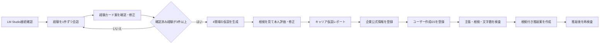

# Polaris MVP スコープ定義

## 1. プロダクト概要

Polarisは、ローカルLLMとの会話からユーザーの経験を整理し、根拠をたどれるキャリア仮説と、事実を創作しないES推敲を提供する就活支援Webアプリである。

主要価値は次の2つに限定する。

1. AIとの会話による、根拠付き自己分析
2. 本人が確認した経験と企業情報に基づく、根拠付きES検査・推敲

自己分析ではMBTIや性格タイプへ分類しない。以下の4領域を、現時点の仮説として整理する。

| 領域 | 定義 | 出力例 |
|---|---|---|
| CAN | 実際の経験で確認できる、再現可能性のある行動 | 問題を工程単位に分け、小さく試す |
| WANT | 判断・選択で大切にしている価値観 | 利用者の反応を直接確認できること |
| ENERGY | 活動後に意欲・充実感が増減する条件 | 改善結果が見える活動で元気になる |
| CONTEXT | 力を発揮しやすい、または負荷がかかる環境 | 裁量のある少人数チームで動きやすい |

## 2. 想定ユーザー

- 就活を始めたが、自分の経験をうまく言語化できない学生
- 企業ごとにESを書き直す負担を感じている学生
- 汎用生成AIが数字・役割・企業情報を盛ることに不安がある学生

MVPはデモPCを使う単一ユーザーを対象とし、アカウント登録・ログイン・複数端末同期は行わない。

## 3. 必須ユーザーフロー

## 4. MVP完成条件

- LM Studioの起動・モデルロード状態を画面から確認できる。
- 自己分析チャットではAIが一度に一つだけ質問する。
- 会話から3件以上の経験カード案を作成できる。
- ユーザーが経験カードを修正し、確認済みにできる。
- CAN／WANT／ENERGY／CONTEXT仮説を作成できる。
- 各仮説から根拠の経験とユーザー発言へ遡れる。
- 仮説に「当てはまる／一部／当てはまらない／追加で考えたい」を保存できる。
- Must／Prefer／Avoid／Verifyを含むキャリア仮説レポートを表示できる。
- 企業情報を文章貼り付けで登録し、事実と出典引用を対応づけられる。
- ユーザーが自作したESを登録できる。
- 本人の経験・企業情報との一致、一部一致、根拠不足、矛盾を表示できる。
- 根拠付き推敲案と変更理由を表示できる。
- 推敲後の文章を同じルールで再検査できる。
- LM Studio未起動、AI出力不正、タイムアウトをユーザーが復旧できる形で表示できる。

## 5. 優先度

### P0 — 必ず完成させる

- LM Studio接続確認
- 自己分析チャット
- 経験カード生成・確認・修正
- 4領域の仮説生成・本人評価
- キャリア仮説レポート
- 自己分析の代表fixture・評価ケース
- 企業情報の文章貼り付け
- ES検査・推敲・再検査

### P1 — P0完成後、余裕がある場合に追加

- 企業公式ページのURL取得
- 登録済み候補企業からの根拠付き企業提案
- 企業提案実行時の公式採用URL再取得とキャッシュ
- チームが選定した10〜20社の候補企業fixture
- `contracts/company-catalog.schema.json`に従う候補企業データ
- ES変更単位の採用・却下
- ES設問に使う経験候補の提案
- 面接の深掘り質問・逆質問
- デモ用の星図表現

### P2 — ハッカソン後

- PDF・DOCX取り込み
- JavaScriptレンダリングが必要な企業ページ取得
- 候補カタログ外の企業・インターン候補の提示
- Web検索APIを使った任意企業の発見
- 複数ES間の矛盾検査
- 音声入力・面接練習
- RAG・ベクトル検索
- 認証・複数ユーザー・PostgreSQL

## 6. MVP対象外

- MBTIなどの性格タイプ診断
- 「適性82点」「企業との相性91%」のような擬似的な精密スコア
- 職種・企業への適性の断定
- 独自AIモデルの学習
- 求人サイトの横断収集・スクレイピング
- 検索サービスなしでローカルLLMの記憶だけから最新企業を提案すること
- 応募の自動化、メール連携
- ユーザー未作成のESをゼロから自動生成する機能
- AIの推測だけで本人・企業の事実を追加すること

## 7. 成功指標

ハッカソン版では統計的な診断精度を主張せず、デモ可能な観察指標を使う。

- 3件の経験から各仮説の根拠へ2操作以内で遡れる。
- 未確認の数字・役割を含むテストESを`NEEDS_CONFIRMATION`または`CONTRADICTED`にできる。
- 推敲後に新しい未確認事実が0件である。
- 企業情報の各事実に出典引用が存在する。
- 代表デモシナリオがLM Studio起動後5分以内に完走する。
- P1の企業提案を実装した場合、各提案に取得済み公式出典と最終取得日時が表示される。

## 8. 1週間版の実装ゲート

次のゲートを満たすまで、後続機能へ人員を移さない。

| Gate | 完了条件 | 次に着手できる機能 |
|---|---|---|
| G1 自己分析 | 3件の経験、4領域、根拠遡及、本人修正がE2Eで動く | ES推敲 |
| G2 ES | 企業文貼り付け、主張検査、推敲、再検査がE2Eで動く | 企業提案 |
| G3 企業提案 | 10〜20社のfixture、公式URL取得、本命／挑戦／意外枠が動く | UI改善・追加機能 |

G1またはG2が未完成の場合、企業提案は発表上の拡張構想に留める。
